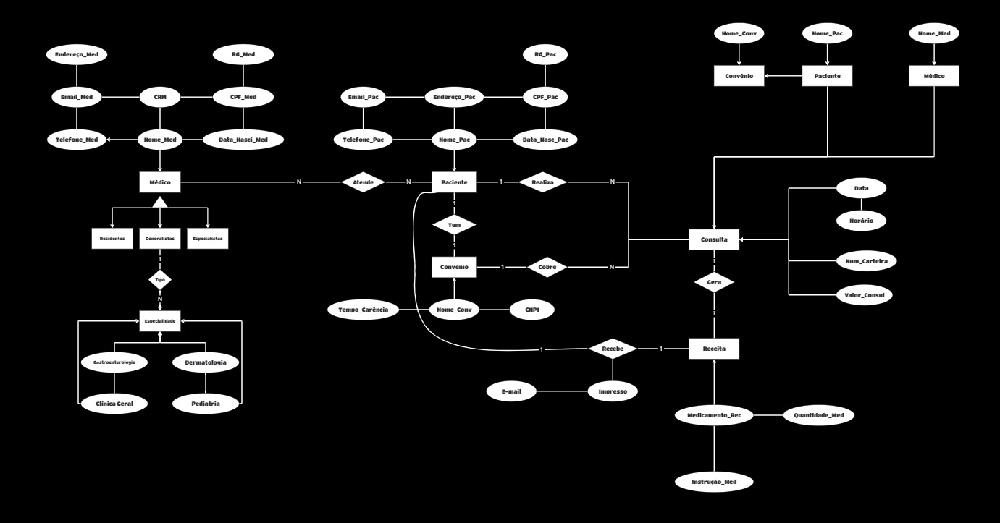

# DataBaseHospital

## O Hospital Fundamental Parte 1

Este repositório é dedicado ao projeto de um sistema de controle de consultas médicas, desenvolvido para atender às necessidades de um hospital local que busca informatizar e otimizar seus processos clínicos.

## Descrição do Projeto

O hospital deseja migrar sua operação de planilhas e arquivos antigos para um sistema moderno, onde será possível gerenciar médicos, pacientes, convênios, consultas e receitas médicas. O objetivo é criar uma estrutura de banco de dados robusta que permita o controle eficiente desses dados.

## Requisitos do Sistema

### Médicos
- **Tipos**: Generalistas, Especialistas, Residentes.
- **Informações**: Dados pessoais, especialidades (Pediatria, Clínica Geral, Gastroenterologia, Dermatologia).
- **Cadastro atual**: Digital (planilhas) e registros físicos (formulários de papel).

### Pacientes
- **Dados pessoais**: Nome, Data de nascimento, Endereço, Telefone, E-mail.
- **Documentos**: CPF, RG.
- **Convênio**: Nome, CNPJ, Tempo de carência.

### Consultas
- **Dados da consulta**: Data, Hora, Médico responsável, Paciente, Valor da consulta ou Convênio (incluindo número da carteira).
- **Especialidade médica**: Especialidade buscada pelo paciente.

### Receitas Médicas
- **Dados**: Medicamentos receitados, Quantidade, Instruções de uso.
- **Relatórios**: Impressão ou visualização via internet.

## Diagrama Entidade-Relacionamento (ER)

O Diagrama ER foi desenvolvido utilizando a ferramenta Miro, refletindo as necessidades descritas acima. Ele demonstra a estrutura de tabelas que será implementada no banco de dados do sistema.

### Print da parte 1 do Diagrama ER

## Tecnologias Utilizadas
- Miro (para criação do Diagrama ER)

## Autor
Este projeto foi desenvolvido como parte de um exercício de modelagem de banco de dados proposto pelo Professor Gabriel.
---
