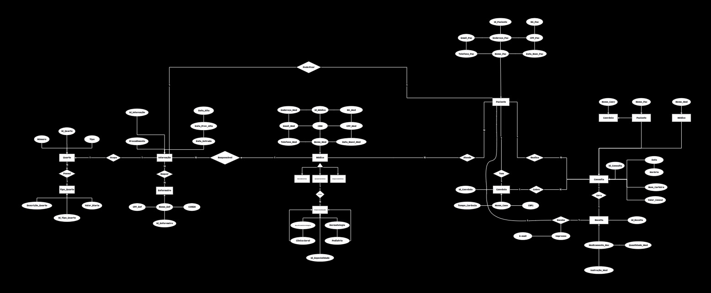

# DataBaseHospital

## O Hospital Fundamental  Parte 1

Este repositório é dedicado ao projeto de um sistema de controle de consultas médicas, desenvolvido para atender às necessidades de um hospital local que busca informatizar e otimizar seus processos clínicos.

## Descrição do Projeto

O hospital deseja migrar sua operação de planilhas e arquivos antigos para um sistema moderno, onde será possível gerenciar médicos, pacientes, convênios, consultas e receitas médicas. O objetivo é criar uma estrutura de banco de dados robusta que permita o controle eficiente desses dados.

## Requisitos do Sistema

### Médicos
- **Tipos**: Generalistas, Especialistas, Residentes.
- **Informações**: Dados pessoais, especialidades (Pediatria, Clínica Geral, Gastroenterologia, Dermatologia).
- **Cadastro atual**: Digital (planilhas) e registros físicos (formulários de papel).

### Pacientes
- **Dados pessoais**: Nome, Data de nascimento, Endereço, Telefone, E-mail.
- **Documentos**: CPF, RG.
- **Convênio**: Nome, CNPJ, Tempo de carência.

### Consultas
- **Dados da consulta**: Data, Hora, Médico responsável, Paciente, Valor da consulta ou Convênio (incluindo número da carteira).
- **Especialidade médica**: Especialidade buscada pelo paciente.

### Receitas Médicas
- **Dados**: Medicamentos receitados, Quantidade, Instruções de uso.
- **Relatórios**: Impressão ou visualização via internet.

## Diagrama Entidade-Relacionamento (ER)

O Diagrama ER foi desenvolvido utilizando a ferramenta Miro, refletindo as necessidades descritas acima. Ele demonstra a estrutura de tabelas que será implementada no banco de dados do sistema.

### Print da parte 1 do Diagrama ER

## Tecnologias Utilizadas
- Miro (para criação do Diagrama ER)
---
# O Hospital Fundamental  Parte 2

Nesta segunda parte do projeto, foi necessário expandir o modelo de banco de dados para incluir o controle de internações no hospital, além de outras funcionalidades essenciais.

## Descrição da Expansão

### Internações
- **Dados registrados**: Data de entrada, Data prevista de alta, Data efetiva de alta, Descrição dos procedimentos.
- **Quartos**: Cada internação é vinculada a um quarto. Os quartos têm numeração e tipo (apartamento, quarto duplo ou enfermaria), além de um valor diário.
- **Enfermaria**: Controla os profissionais responsáveis pelo acompanhamento do paciente. Cada enfermeiro(a) tem nome, CPF e registro no COREN.
- **Relacionamento**: Cada internação está vinculada a um paciente, que pode se internar mais de uma vez, e a um médico responsável único.

### Tarefas
- **Expansão do Diagrama ER**: O diagrama original foi expandido para incluir as novas entidades (Internação, Quartos, Enfermaria).
- **Script SQL**: Foi criado um script SQL para geração do banco de dados, contendo instruções para criar as tabelas e relacionamentos, com colunas, chaves primárias e estrangeiras, baseando-se no diagrama atualizado.

## Diagrama Entidade-Relacionamento (ER) - Parte 2

O diagrama foi atualizado para refletir a nova estrutura do sistema de banco de dados, incorporando as novas entidades e relacionamentos. Ele foi elaborado utilizando as mesmas ferramentas da Parte 1.

### Print do Diagrama ER Atualizado

## Script SQL

O script SQL foi gerado para criar o banco de dados completo, incluindo as novas entidades e suas relações. Este script pode ser executado em ferramentas como MySQL Workbench ou DBdiagram.io.

## Como Executar o Script SQL (disponível em breve)

1. Clone este repositório.
2. Abra o arquivo SQL em um ambiente MySQL ou DBdiagram.io.
3. Execute o script para gerar o banco de dados.
4. Verifique as tabelas geradas e relacione-as conforme o diagrama ER.

## Ferramentas Utilizadas
- Miro (para o diagrama ER)
- MySQL Workbench (para geração e execução do script SQL)

## Autor
Este projeto foi desenvolvido como parte de um exercício de modelagem de banco de dados proposto pelo Professor Gabriel.
---
